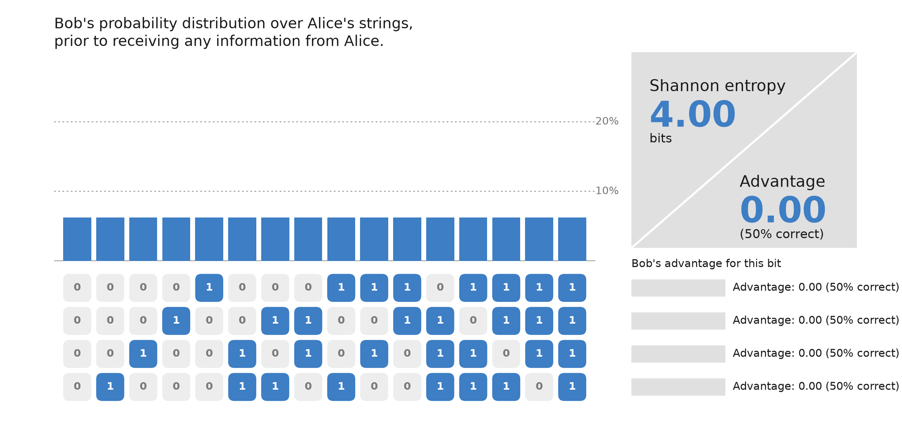
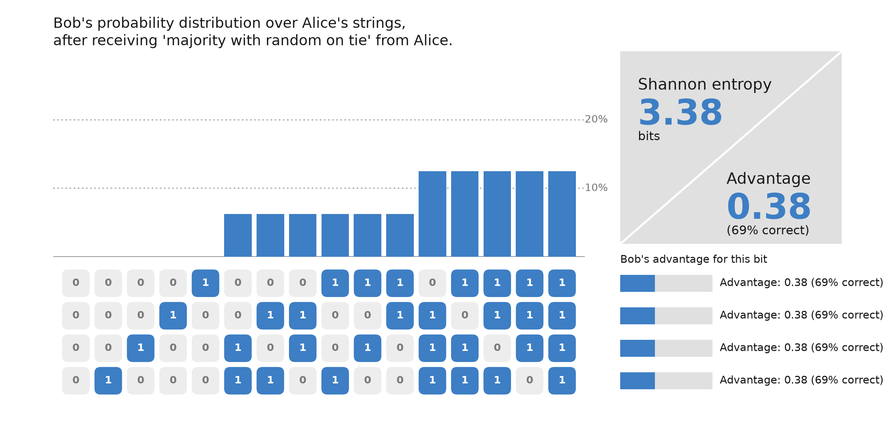
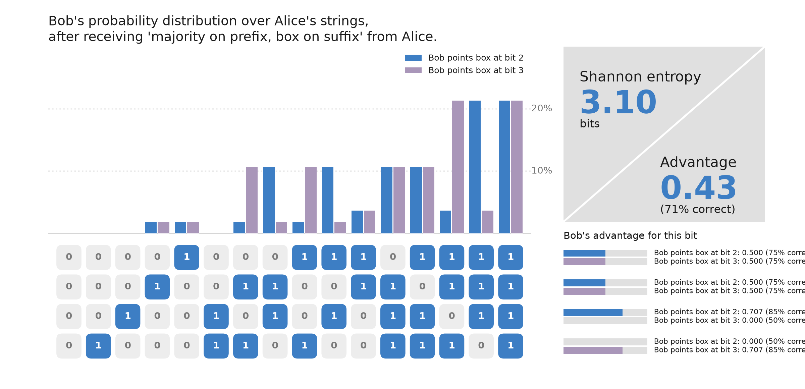

# Quantum advantage in a (Q)SeaBattle game

*Alice and Bob play a collaborative version of (Quantum)SeaBattle with one bit of communication. We hand them a quantum resource and show that the slightest bit of quantum already helps them outperform the classical benchmark — not by telling Bob more, but by letting him choose what his information means.*

<!-- Feature image: Figure_2-1.png (the 3D sphere/octahedron) -->

Stripped of the ships, the QSeaBattle game is a 'random access code' [1]: Alice holds a bit string that is unknown to Bob. Bob gets an index Alice cannot see in advance, and he must guess the bit at that index. Alice can send a single bit to support Bob. The optimal classical strategy is the majority strategy (see our earlier post): Alice sends the bit that occurs most, Bob follows it. This is proven to be the optimal strategy for classical communication [1].

In this post, we will discuss what happens when Alice and Bob share an entangled quantum resource. The short version: the moment their shared resource crosses out of the classical world, they beat the majority strategy — but, this not because Alice is able to share *more* information with Bob.

### A magical box for two bits

Let us build from the smallest case. Alice has two bits, Bob is to guess one of them. Around 2009, Pawłowski and Żukowski [2] wrote down exactly the resource we need. They built it as a 'quantum device' from an entangled photon pair. We will skip the photons and jump straight to what the device does.

Alice feeds her two bits into her half of the device and out comes a single bit — a $1$ or a $0$ — which she sends to Bob. Alice's device has a dial, like aiming at a point on a globe. Bob feeds Alice's bit into his half of the device, and indicates which bit he is after: Alice's first, or her second.

Alice's dial does not decide *which* bit Bob receives — Bob does that, after he knows his index. What Alice's dial decides is *how much* of each bit is on offer. Point at the North Pole and the box hands Bob her first bit with certainty ($100\%$ win rate) while her second washes out to a coin flip; point at the South Pole and it is the other way round. Set the dial on the equator and both bits are equally available — each at a win rate of about $85\%$, whichever bit Bob picks. **Alice decides how much he information gets; Bob decides to what bit that information applies.**

### The dial draws a sphere

The dial is not just a metaphor — it is the picture. For any strategy and any single bit, we can score how well Bob tracks that bit with one number, the *advantage*, running from $-1$ to $+1$. Zero is a pure guess; plus one is certainty; minus one is its mirror. Advantage is the win rate rescaled: $P_i = \tfrac12(1 + c_i)$.Call the advantages for the two indices $(c_0, c_1)$. As Alice sweeps her dial from pole to pole through angle $\theta$, these are

$$c_0 = \cos\theta, \qquad c_1 = \sin\theta,$$

so $c_0^2 + c_1^2 = 1$. Every dial setting is a point on a *circle* in the advantage plane. The two poles are the two clean bits; the equator is the even blend. Note that the total is fixed at one — Alice chooses its *direction*, never its length. 

Now overlay what a classical resource can reach. Without the box, Alice's one bit can lean toward one index or the other, but it must trade — the sum $|c_0| + |c_1|$ cannot exceed one, so the classical strategies fill a diamond. Majority sits at the $(1,1)$ direction of that diamond, where the advantage is spread evenly. The circle bulges outside the diamond everywhere except at the four corners, where they touch. Those corners are the classical strategies that give up on one bit entirely to nail the other. Everywhere in between, the circle is strictly further out.

That crescent between diamond and circle is the whole point. Every strategy inside it is reachable with the quantum device and *impossible* classically — no classical resource ever pushes past $|c_0| + |c_1| = 1$. It appears already at $n=2$, the smallest game there is.

> *Figure 1: Two bits, two advantages $(c_0, c_1)$. Classical strategies fill the diamond $|c_0| + |c_1| \le 1$; Alice's dial traces the circle $c_0^2 + c_1^2 = 1$. Majority sits on the $(1,1)$ diagonal inside the diamond. The crescent between diamond and circle — reachable by the quantum device, impossible classically — is the quantum-beyond-classical region.*
>
> Alt-text: A square diamond inscribed in a circle. The circle touches the diamond at its four vertices and bulges outside it along every edge. The crescent between diamond edge and circle arc is shaded to highlight the quantum-beyond-classical region. Majority and the quantum optimum are marked on the (1,1) diagonal.

The sphere is not merely a convenient picture. It *is* the quantum state space, seen through the lens of this communication task.

Now consider what the box does on three bits. For two bits Alice needed only one angle — a circle is a globe seen edge-on. Pawłowski and Żukowski's second primitive [2] handles *three* bits, and there Alice uses both latitude and longitude to aim anywhere on an actual sphere. The three advantages $(c_0, c_1, c_2)$ now satisfy $c_0^2 + c_1^2 + c_2^2 = 1$, and the classical reachable set is an octahedron sitting inside that sphere, the two touching only at the six poles. Same crescent, one dimension higher.

> *Figure 2: Three bits, three advantages. Alice's full dial reaches any point on the sphere $c_0^2 + c_1^2 + c_2^2 = 1$; the classical polytope sits inside it, the two touching only at the six poles. Majority and the quantum optimum are marked on the $(1,1,1)$ diagonal.*
>
> Alt-text: A polytope inscribed in a sphere, touching at its six vertices. The sphere bulges outside every triangular face. Three coordinate axes are labelled c_0, c_1, c_2. The classical domain (blue) and quantum domain (gold) are indicated in the legend.

So the pattern is not an accident of two bits. Wherever the classical strategies fill a flat-faced polytope, the box rounds it out to a sphere — and a sphere always contains more.

### Bob knows no more — he just chooses

So, does the quantum version win by telling Bob more? Did the 'entanglement' somehow function as a transmission channel for information from Alice to Bob?

It does not. Alice still sends one bit, with the same balanced statistics as before — averaged over everything, Bob learns exactly as much about her board as majority told him. The box does not stuff more of the board into the message. To see what *does* change, let us go back to the geometry.

In both the classical and the quantum case, Alice fixes a point — she aims her dial before knowing Bob's index. Bob then picks which coordinate axis to read. He does not move the point; he chooses which component of it to extract. When he picks bit 1, he reads the $c_1$ component. When he picks bit 2, he reads $c_2$. The point is the same either way.

This is exactly why the sphere beats the diamond. On the diamond, Alice's advantages are budgeted linearly: $|c_0| + |c_1| \leq 1$, so giving more to one axis takes from the other directly. On the sphere the budget is quadratic: $c_0^2 + c_1^2 = 1$, so both components can be larger simultaneously. The sphere is rounder, not bigger in total. Alice doesn't have more to give — she just loses less in the split.

Rather than working through all possible strategies, let us look at the smallest one that already beats majority. We use a 4-cell board and give Alice the following strategy: she plays majority on the first two bits, and when these two bits tie she falls back to the 2-bit quantum primitive (the one from Figure 1) on the last two bits. The classical majority handles the first part of the board; the quantum box handles the tail.

Figure 3 shows the starting point. Before Alice shares anything, Bob's knowledge is uniformly distributed — each board is equally likely.

> *Figure 3: Bob's probability distribution over Alice's strings, before receiving any information. All 16 strings are equally likely. Shannon entropy is 4.00 bits; advantage for every index is zero.*
>
> Alt-text: A bar chart showing 16 equal-height bars, one for each 4-bit string. A side panel shows Shannon entropy at 4.00 bits and advantage at 0.00 (50% correct). Below, four rows of bit strings each show advantage 0.00.

Based on Alice's bit, Bob can form a posterior — a probability over which string she holds. In Figure 4 we show Bob's posterior if Alice sends a '1' under the majority strategy. He knows that she cannot hold a board with zero or one '1' (for then she would have send a '0'), and is more likely to hold a board with a majority of 1's than a tied board.

> *Figure 4: Bob's posterior after Alice sends '1' under the majority strategy. Boards with more 1's become more likely; boards with zero or one '1' are ruled out. Shannon entropy drops to 3.38 bits. The advantage is the same for every index — 0.38, or 69% correct.*
>
> Alt-text: A bar chart with 16 bars of varying heights, taller for strings with more 1's. A side panel shows Shannon entropy at 3.38 bits and advantage at 0.38 (69% correct). Below, four rows of bit strings each show identical advantage of 0.38.

Classically, Bob has *one* lookup table, fixed when Alice created her bit. Whatever index he is later handed, he reads the same table, so his posterior is the same histogram every time. His decoder was frozen at coding.

Now look at what happens with the quantum box. Alice has fixed her point on the sphere — she aimed the dial before knowing Bob's index. But Bob, when he learns his index, picks which axis to project that point onto. He does not move the point. He reads one component instead of another. Figure 5 shows both options side by side. When Bob reads the $c_2$ component, his advantage on bit 2 sharpens to $0.707$ (an $85\%$ win rate) while bit 3 drops to a coin flip. When he reads $c_3$, they swap. The total information — the Shannon entropy — is the same either way: 3.10 bits. Nothing was added. Bob just aimed his readout at the cell that turned out to matter.

> *Figure 5: Bob's posterior under the hybrid strategy (majority on the prefix, quantum box on the suffix). The blue and purple histograms show what happens when Bob reads the $c_2$ or $c_3$ component respectively. The advantage shifts between the two suffix indices, but the Shannon entropy (3.10 bits) is the same either way. Bob aims his readout; he does not increase his information.*
>
> Alt-text: A bar chart with paired blue and purple bars for each of 16 strings, showing two different posteriors. A side panel shows Shannon entropy at 3.10 bits and advantage at 0.43 (71% correct). Below, four rows show per-bit advantages that differ between the two box settings — when one suffix bit has high advantage the other has low, and vice versa.

So the quantum advantage is not that Bob is told more. It is that classically the decoder is spent at coding — one table, no take-backs — while the quantum device lets Bob spend the same budget *after* he knows which bit he wants. He projects Alice's fixed point onto the axis that turned out to matter, and accepts a coin flip on the one that did not. And all of this without a signal travelling from Bob back to Alice.

That, in one sentence, is what people mean by 'quantum advantage' in this game. Not more information — better-timed information.

### So, what does the slightest quantum buy?

We started with a coin that could protect Alice and Bob but never help them win. We end with a single shared box that lets them win the moment its correlations step outside the classical world. Drawn as geometry, the classical strategies fill a flat diamond and the quantum resource rounds it into a sphere; every point of the crescent between them is a game Alice can win more often, and none of it is reachable classically. And she wins it without Bob ever knowing more about her board — the box only lets his question arrive in time to shape what his answer means.

We have drawn the quantum boundary as a sphere — the outer edge of what the box can reach. But is that sphere really the edge of the *possible*? Nothing in the game so far forbids a stronger resource, one that would bulge past even the sphere, handing Bob correlations no quantum state can. Nature, it appears, refuses to go there — the sphere is exactly as far as it lets us reach, and not one step further. Why the boundary sits *there*, and what would go wrong if it did not, is the question we will pick up next, when we introduce post-quantum resources.

The simulations and source code are available on [GitHub](https://github.com/robhendrik/QSeaBattle).

### References 

[1] A. Ambainis, D. Leung, L. Mancinska, M. Ozols, *Quantum Random Access Codes with Shared Randomness*, arXiv:0810.2937 (2009).

[2] M. Pawłowski, M. Żukowski, *Entanglement-assisted random access codes*, Phys. Rev. A **81**, 042326 (2010).