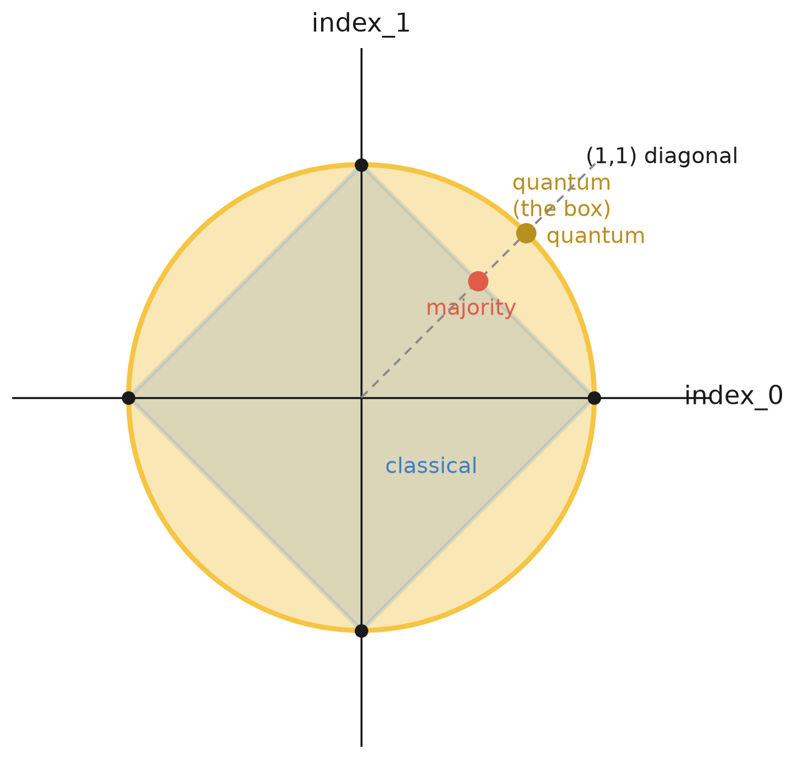
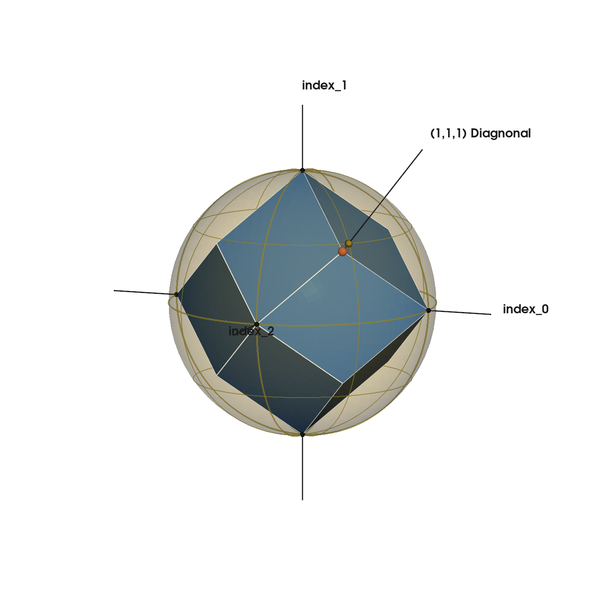

# Quantum advantage in a (Q)SeaBattle game

*Alice and Bob play a collaborative version of (Quantum)SeaBattle with one bit of communication. We hand them a quantum resource and show that the slightest bit of quantum already helps them outperform the classical benchmark. This quantum advantage brought to the bare essence*

Stripped of the ships, the QSeaBattle game is a 'random access code' [1]: Alice holds a bit string that is unknown to Bob. Bob gets an index Alice cannot see in advance, and he must guess the bit at that index. Alice can send a single bit to support Bob. The optimal strategy when Alice and Bob share only classical information is the majority strategy (see our earlier post): Alice sends the bit that occurs most, Bob follows it. This is proven to be the optimal strategy [1].

In this post, we will discuss what happens when Alice and Bob share an entangled quantum resource. The short version: the moment their shared resource crosses out of the classical world, they beat the majority strategy — and, as we will see, while a quantum resource helps Bob guess the bit at his index, it does not actually give him more information about Alice's bit string.

For any strategy and any single bit, we can score how well Bob tracks that bit with one number, the *advantage*, running from $-1$ to $+1$. Zero is a pure guess — Bob knows nothing, and wins half the time. Plus one is certainty — Bob is always right. Minus one is its mirror — Bob is always *wrong*. So the sign tells us which way Bob points his knowledge, and the magnitude tells us how much he has. Advantage is the win rate rescaled, $P = \tfrac12(1 + c)$.

### A magical box for two bits

Let us build from the smallest case. Alice has two bits, Bob is to guess one of them. Around 2009, Pawłowski and Żukowski [2] wrote down exactly the resource we need. They built it from an entangled photon pair, but we can skip the photons and jump straight to what the device does. 

It works like this. Alice feeds her two bits into her half of the device and out comes a single bit, a $1$ or a $0$, which she sends to Bob. Alice's device has a dial with two settings — a latitude and a longitude, like aiming at a point on a globe. Bob feeds Alice's bit into his half, and on his own device he indicates which he is after: Alice's first bit, or her second.

Alice's dial does not decide *which* bit Bob receives — Bob does that, after he knows his index. What Alice's dial decides is *how much* of each bit is on offer. Point at the North Pole and the box hands Bob her first bit with certainty (advantage $1$, a $100\%$ win rate) while her second washes out to a coin flip (advantage $0$); point at the South Pole and it is the other way round. Set the dial on the equator and Bob is equally likely to retrieve either — each at advantage $\tfrac{1}{\sqrt2}$, a win rate of $\tfrac12(1 + \tfrac{1}{\sqrt 2}) \approx 0.85$, whichever bit he picks. In between, Alice slides smoothly from one bit to the other. So her dial traces a whole circle of allocations, and Bob, once his question arrives, reads off wherever she left it. **Alice decides how much he gets; Bob decides what he wants.**

### The dial draws a sphere

The dial is not just a metaphor — it is the picture. Give the strategy its two advantages: how strongly Bob's output tracks Alice's first bit, and her second. Call the advantages for the two indices $(\text{index}_0, \text{index}_1)$. As Alice sweeps her dial from pole to pole through angle $\theta$, these are

$$\text{index}_0 = \cos\theta, \qquad \text{index}_1 = \sin\theta,$$

so $\text{index}_0^2 + \text{index}_1^2 = 1$. Every dial setting is a point on a *circle* in this advantage plane. The two poles are the two clean bits; the equator is the even blend. Note that the total is fixed at one — Alice chooses its *direction*, never its length.

Now overlay what a classical resource can reach. Without the box, Alice's one bit can lean toward one cell or the other, but it must trade — the sum $|\text{index}_0| + |\text{index}_1|$ cannot exceed one, so the classical strategies fill a diamond. Majority sits at the $(1,1)$ direction of that diamond, where the advantage is spread evenly across the indices. The circle bulges outside the diamond everywhere except at the four corners, where they touch. Those corners are exactly the classical strategies that give up on one bit entirely to nail the other. Everywhere in between, the circle is strictly further out.

That crescent between diamond and circle is the whole point. Every strategy inside it is reachable with the quantum device and *impossible* classically — no classical resource ever pushes past $|\text{index}_0| + |\text{index}_1| = 1$. So the advantage is not a number, it is a region, and the region is precisely quantum-beyond-classical. It appears already at $n=2$, the smallest game there is.

> **[FIGURE 1 — the 2D primitive]**
> **Caption:** *Two bits, two advantages $(index_0, index_1)$. Classical strategies fill the diamond $|index_0| + |index_1| \le 1$; Alice's dial traces the circle $index_0^2 + index_1^2 = 1$. The crescent between them — reachable by the box, impossible classically — is the quantum-beyond-classical region.*
> **Alt-text:** A square diamond inscribed in a circle. The circle touches the diamond at its four vertices and bulges outside it along every edge; the crescent region between diamond edge and circle arc is shaded to mark where quantum reaches and classical cannot.

Now consider what the box does on three bits. Here the latitude-and-longitude language pays off. For two bits Alice needed only one angle — a circle is a globe seen edge-on. Pawłowski and Żukowski's second primitive [2] handles *three* bits, and there Alice uses the full dial, both latitude and longitude, to aim anywhere on an actual sphere. The three advantages $(c_0, c_1, c_2)$ now satisfy $c_0^2 + c_1^2 + c_2^2 = 1$, and the classical reachable set is an octahedron sitting inside that sphere, the two touching only at the six poles. Same box, same crescent, one dimension higher.

> **[FIGURE 2 — the 3D primitive]**
> **Caption:** *Three bits, three advantages. Alice's full dial (latitude and longitude) reaches any point on the sphere $index_0^2 + index_1^2 + index_2^2 = 1$; the classical polytope sits inside it, the two touching only at the six poles.*
> **Alt-text:** An polytope inscribed in a sphere, touching at its six vertices, the sphere bulging outside every triangular face.

So the pattern is not an accident of two bits. Wherever the classical strategies fill a flat-faced polytope, the box rounds it out to a sphere — and a sphere always contains more.

### Bob knows no more — he just chooses 

So, does the quantum version win by telling Bob more (by sharing more information)? Did the ‘entanglement’ somehow function as a transmission channel for information from Alice to Bob?

It does not. Alice still sends one bit, with the same balanced statistics as before — averaged over everything, Bob learns exactly as much about her board as majority told him. The box does not stuff more of the board into the message.

To see this properly, let us look at what Bob Alice's communication does with Bob's informayion. Iniyiallu uniform (see fig x). Give him Alice's bit and let him form a posterior — a probability over which string she holds — and put Shannon's number next to it. This is fogure Y.

Classically Bob has *one* lookup table, fixed when they agreed the strategy. It almost feels too intuitive to state tha the lookup is defined when Alices creates her bit. Whatever index he is later handed, he reads the same table, so his posterior is the same histogram every time, with the same entropy. His decoder was frozen at coding.

Fig x Before any info
Fig y Majority strategy

The box changes one thing: Bob has *two* tables, and he picks which to read after he sees his index. Take the two-bit primitive, where it is starkest. If Bob selects Alice's first bit, his posterior on that bit sharpens — the histogram piles up, entropy drops to about $0.60$ bits — but his posterior on the second bit goes flat, a full $1.00$ bit of uncertainty, a coin. Select the other and the two swap. He can make one bit sharp only by leaving the other blank. What he cannot do is beat the total: the two tables carry the same information between them that the one classical table did. Nothing was added to the message.

Figure Z shows this figure
Figure Z- the box for hybrid srategy
> **[FIGURE 4 — what Bob knows]**
> **Caption:** *Bob's posterior over Alice's strings, with Shannon entropy alongside. Left: the single classical table — one fixed histogram, read no matter which index Bob is asked. Right: the box's two tables — Bob slides the sharp posterior onto the bit he actually wants (entropy $\approx 0.60$ bits) at the cost of a flat posterior on the other ($1.00$ bit). Same total information, reallocated after the fact.*
> **Alt-text:** Two side-by-side panels of bar histograms over Alice's strings. Left panel: one histogram labelled 'one table, fixed at coding', with an entropy value. Right panel: two histograms labelled 'table A' and 'table B', one sharply peaked (low entropy) and one nearly flat (high entropy), with an arrow labelled 'Bob picks after seeing his index'.

So the quantum advantage is not that Bob is told more. It is that classically the decoder is spent at coding — one table, no take-backs — while the quantum device lets Bob spend the same budget *after* he knows which bit he wants. He moves his certainty onto the cell that turned out to matter, and accepts ignorance on the one that did not. And all of this without a signal travelling from Bob back to Alice; his choice reaches back through the shared box, not through a wire.

That, in one sentence, is what people mean by 'quantum advantage' in this game. Not more information — better-timed information.

### So, what does the slightest quantum buy?

We started with a coin that could protect Alice and Bob but never help them win. We end with a single shared box that lets them win the moment its correlations step outside the classical world. Drawn as geometry, the classical strategies fill a flat diamond and the quantum resource rounds it into a sphere; every point of the crescent between them is a game Alice can win more often, and none of it is reachable classically. And she wins it without Bob ever knowing more about her board — the box only lets his question arrive in time to shape what his answer means.

We have drawn the quantum boundary as a sphere — the outer edge of what the box can reach. But is that sphere really the edge of the *possible*? Nothing in the game so far forbids a stronger resource, one that would bulge past even the sphere, handing Bob correlations no quantum state can. Nature, it appears, refuses to go there — the sphere is exactly as far as it lets us reach, and not one step further. Why the boundary sits *there*, and what would go wrong if it did not, is the question we will pick up next, when we introduce post-quantum resources.

> **Figure 7:** Find out more about QSeaBattle on the GitHub repo.

### References

[1] A. Ambainis, D. Leung, L. Mancinska, M. Ozols, *Quantum Random Access Codes with Shared Randomness*, arXiv:0810.2937 (2009).

[2] M. Pawłowski, M. Żukowski, *Entanglement-assisted random access codes*, Phys. Rev. A **81**, 042326 (2010).
